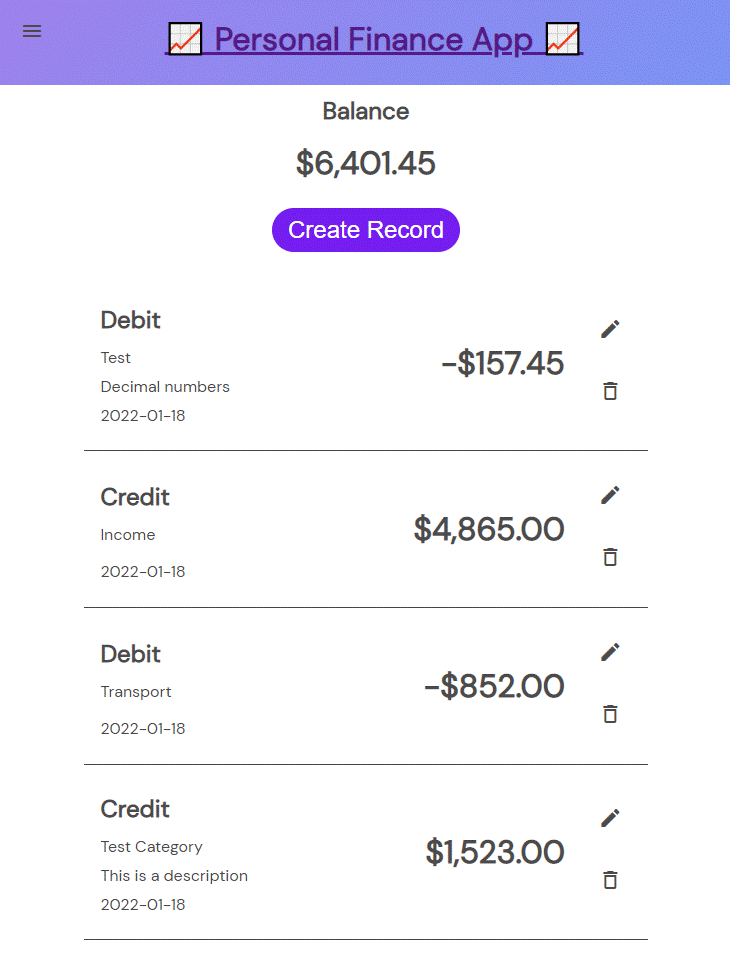

# Alkemy-Challenge
Esta mi entrada para el Challenge de Alkemy.

La consigna: [Challenge Full stack - JavaScript](Challenge_Full_stack_JavaScript.rev2.pdf)

---
###  Notas / Aclaraciones:
En el código utilicé "Debit" y "Credit" para hacer referencia a "Egreso" e "Ingreso" respectivamente. Una vez finalizado me dí cuenta que tal vez es más descriptivo utilizar "Expense" e "Income".

"Dashboard" es Home del Usuario donde puede ver su balance, los últimos registros y agregar/editar/eliminar nuevos registros.

"Login" es donde el usuario se puede autentificar y el frontend recibe el Token.

"Signup" es donde se puede registrar un nuevo usuario.

"Home" es de donde se puede navegar a las distintas páginas. El link a Dashboard está oculto si no hay un token. Acá podría haber alguna presentación de lo que hace la aplicación.

---
### Demo:

---
### Algunas cosas que todavía pueden mejorar o agregar:

Los mensajes de estilo "Popup" sólo están implementados en la página de "login" y "signup", se podría extender la implementacion al resto de la aplicacion.

Crear animaciones de carga (loaders) mientras se espera la respuesta del backend. En un ambiente de desarrollo el tiempo de respuesta es despreciable, pero en un ambiente productivo pueden ser varios segundos y el usuario debe saber que la aplicación esta esperando.

Agregar redirects automáticos una vez que un usuario ingresó o tiene un token válido dirigirlo directamente a la página "Dashboard".

Verificar y eliminar el JWT cuando este llegando al fin de su validez, actualmente el frontend va a hacer request con el token expirado y va a recibir un error de "Auth Failed" del backend.

Hash + salt las contraseñas de los usuarios en la base de datos. Actualmente se almacenan como texto, esto es un riesgo de seguridad si la base de datos llegara a ser comprometida.

Agregar endpoints para consultar datos estadisticos como egresos por categoría, egresos diarios, mensuales, etc.

Agregar endpoint para recuperar contraseña. 

Mejorar el manejo de errores para que sea consistente dentro de toda la aplicación.

Mejorar la documentación, algunas partes están documentadas y otras no tanto.

Validar el input antes de ingresarlo a la base de datos.

Agregar testing automatico con una librería como Jest.

---
## DB structure
* Account (table)
  * email -> notNullable, unique
  * name -> notNullable
  * password -> notNullable
* Record (table)
  * amount -> notNullable
  * type -> enum ['Credit' , 'Debit']
  * category
  * description
  * date -> notNullable
  * Account_id -> notNullable

---
## To do:
### Backend
- [x] Set up DB
  - [x] Set up Migrations
  - [x] Set up Rollbacks
- [x] API:
  - [x] Account management:
    - [x] Set up route for creating account
    - [x] Set up route for login (auth with jwt)
    - [ ] Hash passwords in DB. 
  - [ ] Record management:
    - [x] Set up route for adding records
    - [x] Set up route for getting records
      - [x] Getting last n records
      - [ ] Getting records between dates (optional)
    - [x] Set up route for modifying records
    - [x] Set up route for deleting records
    - [x] Set up route for getting balance

### Frontend
- [x] Start
- [x] Pages
  - [x] Home
  - [x] SignUp
  - [x] LogIn
  - [x] Dashboard
- [x] Components
  - [ ] Menu Bar
  - [x] Record Card
  - [x] NewRecord
  - [x] Popup message
- [x] API Communication
  - [x] Log in
  - [x] Sign up
  - [x] Get last 5 records
  - [x] Get Balance
  - [x] Create new Record
  - [x] Update Record
  - [x] Delete Record
